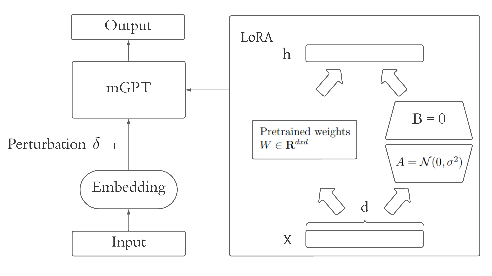

# LAMPAT: Low-rank Adaptation Multilingual Paraphrasing using Adversarial Training

## About The Project

This is an implementation of our research [LAMPAT: Low-rank Adaptation Multilingual Paraphrasing using Adversarial Training](https://drive.google.com/file/d/1LIfVGd8XBsTE2pefAd30eP-mAjyvZYmD/view?usp=sharing).



## Getting Started

To get started, you should have prior knowledge on **Python** and **PyTorch** at first. A few resources to get you started if this is your first Python or PyTorch project:

- [PyTorch Tutorials](https://pytorch.org/tutorials/)
- [Python for Beginners](https://www.python.org/about/gettingstarted/)

## Installation

1. Clone the repo

   ```sh
   git clone https://github.com/phkhanhtrinh23/LAMPAT.git
   ```

2. Use any code editor to open the folder **LAMPAT**.

## Run
1. Create conda virtual environment: `conda create -n lampat python=3.8`, activate it: `conda activate lampat`, and install the required packages: `pip install -r requirements.txt`.

2. Download [wmt19_v18](https://data.statmt.org/news-commentary/v18/)

3. Extract the files to `.txt` files, rename all of the files with their [ISO 639-1](https://en.wikipedia.org/wiki/List_of_ISO_639-1_codes) code, and place them in the path `data/wmt19_v18`. For example: `data/wmt19_v18/en.txt`

4. Read and run `train.sh` to train the **LAMPAT** model.

## Evaluation

### Evaluation dataset

The evaluation dataset can be downloaded at [this link](https://hcmuteduvn-my.sharepoint.com/:f:/g/personal/khoi_le_pi2001_hcmut_edu_vn/EoMfM-T_NNJDmGlv8qBKS4oBINUMdaMF9mDncpNsmtNezw?e=uX4Ab6)

Download the zip file and unzip it to put into the `evaluation/eval_dataset`

### Run

In the `evaluation` folder, there are 3 python files:

- `mev_sup_multi_ref.py`: used to evaluate on STAPLE multi-reference evaluation dataset
- `mev_sup.py`: used to evaluate on PAWS-X and Opusparcus
- `mev_unsup.py`: used to evaluate on WMT19

Each file will run the metrics and report the score to the console

## Contribution

Contributions are what make GitHub such an amazing place to be learn, inspire, and create. Any contributions you make are greatly appreciated.

1. Fork the project
2. Create your Contribute branch: `git checkout -b contribute/Contribute`
3. Commit your changes: `git commit -m 'add your messages'`
4. Push to the branch: `git push origin contribute/Contribute`
5. Open a pull request

## Contact

Email: phkhanhtrinh23@gmail.com

Project Link: https://github.com/phkhanhtrinh23/LAMPAT.git
